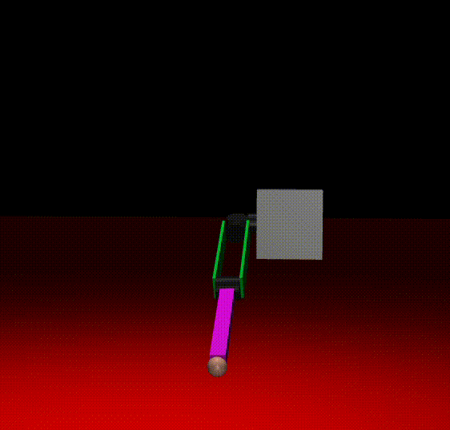

# Robot-Baptist

## Calculation of a Linear Trajectory for the Robo-Arm to Perform a Cross

### Linear Trajectory

A linear trajectory in Euclidean space can be given by a weighted function whose values will be distributed from 0 to 1 in the time interval from 0 to \( T \).

$$
X(t) = X_{start} + s(t)(X_{end} - X_{start})
$$

The velocity and acceleration in this case will be:

$$
\dot{X}(t) = \dot{s}(t)(X_{end} - X_{start}); \quad \ddot{X}(t) = \ddot{s}(t)(X_{end} - X_{start})
$$

Let's define the weighted function with the use of polynomial of degree 5 to set constraints on the start and end of the trajectory.

$$
s(t) = a_0 + a_1t + a_2t^2 + a_3t^3 + a_4t^4 + a_5t^5
$$

According to the weighted function, the velocity and acceleration of the weighted function will be as follows:

$$
\dot{s}(t) = a_1 + 2a_2t + 3a_3t^2 + 4a_4t^3 + 5a_5t^4
$$

$$
\ddot{s}(t) = 2a_2 + 6a_3t + 12a_4t^2 + 20a_5t^3
$$

Assuming that \( s(0)=0 \), \( s(T)=1 \), \( \dot{s}(0)=0 \), \( \dot{s}(T)=0 \), \( \ddot{s}(0)=0 \), \( \dot{s}(T)=0 \), we can obtain the following parameters:

$$
a_0 = a_1 = a_2 = 0; \quad a_3=\frac{10}{T^3};\quad a_4 = -\frac{15}{T^4}; \quad a_5=\frac{6}{T^5}
$$

If you have a limitation on velocity in Cartesian space, you can use the following formula for \( T \) to achieve the maximum velocity in the middle of the trajectory:

$$
T = \frac{15}{8}\frac{\sqrt{(X_{end} - X_{start})^T(X_{end} - X_{start})}}{v_{max}}
$$

### Inverse Kinematics

$$
\begin{array}{rrclcl}
\displaystyle \min_{q} & {(X(t) - FK(q))^T(X(t) - FK(q))}
\end{array}
$$

$$
\dot{q}(t) = J^+(q)\dot{X}(t)
$$

The same approach applies to acceleration:

$$
\ddot{q}(t) = J^+(q)\cdot(\ddot{X}(t) - \frac{dJ(q)}{dt}\cdot\dot{q}(t))
$$

